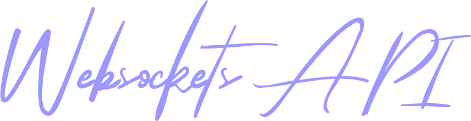

<p align="center">
  
</p>

<p align="center">

  <a href="https://git.io/typing-svg">
    
  </a>

</p>

<p align="center">
  
  
  
  
</p>

## :purple_square: Getting Started

[WebsocketsAPI](https://github.com/zakharb/websocketsapi) is the Service that connect to websocket and extract data from it.  

### Requirements

  
`asyncio` and `websockets` libraries are required.

### Installing

Install via `pip`
```
pip install 
```

## :purple_square: Usage

### Examples

## :purple_square: Versioning

Using [SemVer](http://semver.org/) for versioning. For the versions available, see the [tags on this repository](https://github.com/zakharb/syslogen/tags). 

## :purple_square: Authors

* **Zakhar Bengart** - *Initial work* - [Ze](https://github.com/zakharb)

See also the list of [contributors](https://github.com/zakharb/syslogen/contributors) who participated in this project.

## :purple_square: License

This program is free software: you can redistribute it and/or modify it under the terms of the GNU General Public License as published by the Free Software Foundation - see the [LICENSE](LICENSE) file for details

